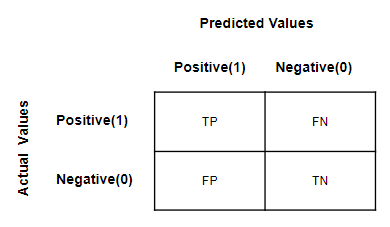

---
sources:
  - page: "Performance Metrics - Classification"
    course_id: 141736
    item_id: 7718103
  - live_class: "LVC 3: Introduction to Supervised Learning and Classification"
    course_id: 141736
    summary_file: 12604566
    transcript_file: 13808560
    recording: "imbalanced data @ 01:08:41, threshold @ 00:24:50"
---

# Classification Performance Metrics

Metrics that tell us how well a [[Classification]] model performs on unseen data.

## Confusion matrix

A cross-tab of **actual vs predicted** classes:

|  | Predicted 1 | Predicted 0 |
|--|-------------|-------------|
| **Actual 1** | TP (True Positive) | FN (False Negative) |
| **Actual 0** | FP (False Positive) | TN (True Negative) |

- **TP** — actual 1, predicted 1
- **TN** — actual 0, predicted 0
- **FN** — actual 1, predicted 0 (missed a positive)
- **FP** — actual 0, predicted 1 (false alarm)



## Balanced vs imbalanced data

If classes are roughly equal in count → **balanced**; otherwise **imbalanced**. This
decides which metric is appropriate.

## The metrics

**Accuracy** — fraction of all predictions that are correct. Good for **balanced** data.

$$
\text{Accuracy} = \frac{TP + TN}{TP + TN + FP + FN}
$$

**Precision** — of all predicted positives, how many are truly positive. Use when
**false positives are costly**.

$$
\text{Precision} = \frac{TP}{TP + FP}
$$

> Example: **spam detection** — a real email landing in spam (FP) is bad → maximize
> **precision**.

**Recall (Sensitivity)** — of all actual positives, how many were caught. Use when
**false negatives are costly**.

$$
\text{Recall} = \frac{TP}{TP + FN}
$$

> Example: **cancer detection** — missing a sick patient (FN) is fatal → maximize
> **recall**.

**F1-score** — the **harmonic mean** of precision and recall; use when both matter or
the data is **imbalanced**.

$$
F_1 = 2 \cdot \frac{\text{Precision} \cdot \text{Recall}}{\text{Precision} + \text{Recall}}
$$

## Exam hooks

- **Precision ↔ false positives** (spam).
- **Recall ↔ false negatives** (cancer).
- **Accuracy** misleads on **imbalanced** data → use **F1**.

## Python hands-on

```python
from sklearn.metrics import (confusion_matrix, accuracy_score,
                             precision_score, recall_score, f1_score)

print(confusion_matrix(y_test, pred))
print(precision_score(y_test, pred), recall_score(y_test, pred), f1_score(y_test, pred))
```

## The accuracy paradox and the cost of errors

In the loan-default data only **3.33%** of records are "default". A **dumb model** that
labels **everyone "no-default"** is therefore **~96.67% accurate** — impressive-looking,
but **useless** (it never catches a defaulter). Lesson: **accuracy misleads on
imbalanced data**.

**Unbalanced cost of errors** — the two error types do not cost the same:

- **FN** (predict a real defaulter as "no-default") → the bank **lends to a defaulter
  and loses money**.
- **FP** (predict a good customer as "default") → the bank **loses a customer / the
  lending opportunity**.

We **shift the decision threshold** toward whichever error is more costly for the
business.

## Summary

- Build intuition from the **confusion matrix** (TP/TN/FP/FN).
- **Precision** guards against FP; **recall** guards against FN; **F1** balances both
  and suits **imbalanced** classes; **accuracy** suits **balanced** classes.
