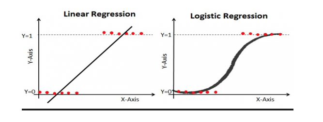
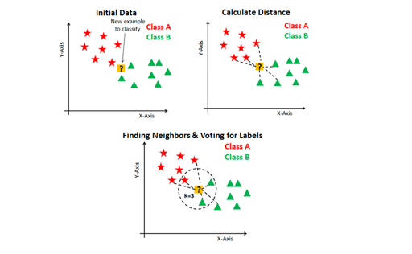
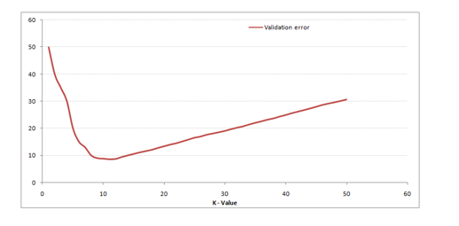

---
sources:
  - page: "Supervised Learning - Classification"
    course_id: 141736
    item_id: 7718102
  - live_class: "LVC 3: Introduction to Supervised Learning and Classification"
    course_id: 141736
    summary_file: 12604566
    transcript_file: 13808560
    recording: "logistic @ 00:17:05, loan default @ 00:19:00"
---

# Classification

**Classification** is supervised learning where the dependent variable is
**categorical** (e.g. spam / not-spam, fraud / not-fraud, churn / no-churn). It can have
two or more categories. Two common algorithms: **Logistic Regression** and
**K-Nearest Neighbors**.

## Logistic Regression

Linear regression is unsuitable for binary 0/1 outputs, so logistic regression adds
non-linearity via the **Sigmoid function**, which maps any input to a value in
**(0, 1)** — perfect for representing a **probability**:

$$
\sigma(z) = \frac{1}{1 + e^{-z}}, \qquad z = \theta_0 + \theta_1 X_1 + \dots
$$

The output is the **probability** of the positive class given the features; a threshold
(commonly 0.5) converts it to a class label.



## K-Nearest Neighbors (K-NN)

A distance-based algorithm (mostly used for classification, but works for regression):

1. **Choose K** — how many nearest neighbors vote. Use an **odd K** when the number of
   classes is even, to avoid tie votes.
2. **Compute distance** from the test point to all training points (Euclidean,
   Manhattan, ...).
3. **Find the K nearest** points.
4. **Majority vote** of their labels → assigned class.



**Choosing K:** plot validation error vs K; as K grows the validation error falls then
rises — pick the **K with the lowest validation error**. Small K → noisy/overfit; large
K → oversmoothed/underfit (links to [[Bias-Variance Tradeoff]]).



See [[Classification Performance Metrics]] for how to evaluate these models, and
[[LDA and QDA]] for discriminant-analysis classifiers.

## Python hands-on

```python
from sklearn.linear_model import LogisticRegression
from sklearn.neighbors import KNeighborsClassifier

logit = LogisticRegression().fit(X_train, y_train)
proba = logit.predict_proba(X_test)[:, 1]   # probability of class 1

knn = KNeighborsClassifier(n_neighbors=5).fit(X_train, y_train)
```

## Worked example: loan default and why not linear regression

Worked example: **loan default** — 10,000 customers with features **Student, Balance,
Income** predicting the binary target **Default / No-default**. The classifier is a
**predictor curve** chosen to **minimise misclassifications**; it can be **linear**
(a line, or a plane in higher dimensions) or **non-linear** (a polynomial curve) —
whichever separates the classes with fewest errors.

**Why not plain linear regression for classification?** A straight line has **no fixed
range**, so it cannot output a probability (we need a value in $[0,1]$), and **MSE is
meaningless** for class labels. The fix: pass the linear input through the **Sigmoid**,
$y = \dfrac{e^{z}}{e^{z}+1} \in (0,1)$, then threshold (usually 0.5) → **logistic
regression**.

## Summary

- Classification predicts a **categorical** target.
- **Logistic regression** uses the **sigmoid** to output a probability in (0, 1).
- **K-NN** classifies by **majority vote** of the K nearest neighbors; pick K by lowest
  validation error, prefer **odd K** with an even number of classes.
