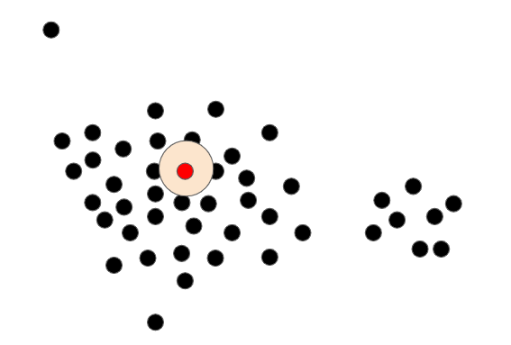
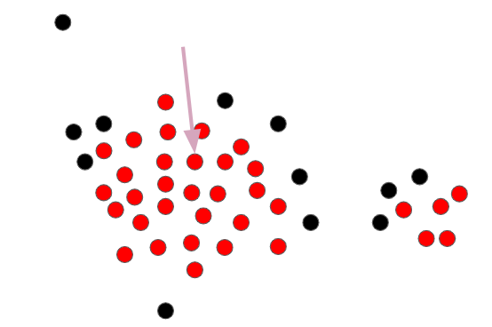
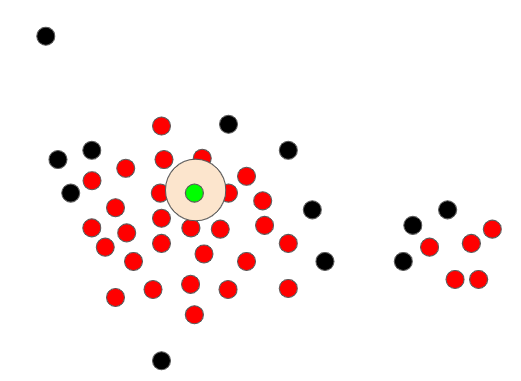
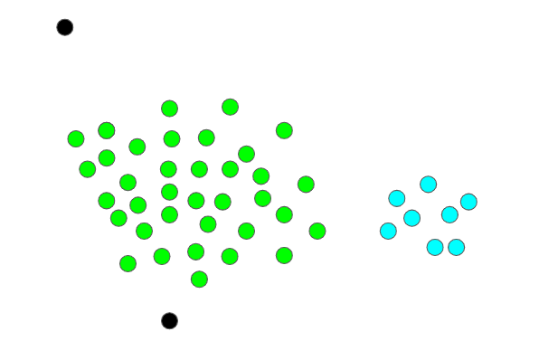

---
sources:
  - page: "DBSCAN"
    course_id: 141735
    item_id: 7718273
---

# DBSCAN

**DBSCAN** (Density-Based Spatial Clustering of Applications with Noise) clusters points by
**density** — the concentration of points in a region. It separates **high-density**
regions (clusters) from **low-density** regions (noise / outliers), so unlike
[[K-means Clustering|K-means]] it can find **arbitrarily shaped** clusters and does **not**
need the number of clusters specified in advance.

## Two parameters

- **epsilon ($\varepsilon$)** — the neighbourhood radius. Two points are **neighbours** if
  the distance between them is below $\varepsilon$ (Euclidean by default).
- **minPoints** — the minimum number of points required to form a **dense** region.



## How it works

1. Pick a point and draw a circle of radius $\varepsilon$ around it; repeat conceptually
   for all points.
2. **Identify core points.** A point is a **core point** if at least **minPoints** points
   lie within its $\varepsilon$-circle. Points that don't meet this are **non-core**.



3. Pick a core point, start a cluster, and **add all core points within $\varepsilon$** —
   expanding outward from core point to core point until no further core point is reachable.



4. A **non-core point** that falls within $\varepsilon$ of the cluster is **added** to it
   but cannot be used to **extend** it (a *border* point).
5. When a cluster can grow no further, a new unvisited core point seeds the next cluster.
   Points that never join any cluster are **outliers (noise)**.



## Point types

| Type | Definition |
|------|-----------|
| **Core** | $\ge$ minPoints within its $\varepsilon$-neighbourhood |
| **Border** | within $\varepsilon$ of a core point, but not itself core |
| **Noise / outlier** | neither core nor border — belongs to no cluster |

## Strengths

- Finds **non-convex** clusters that K-means cannot.
- **Detects outliers** explicitly as noise.
- **No need to pre-set $K$** — the number of clusters emerges from the density.

## Python hands-on

```python
from sklearn.cluster import DBSCAN

db = DBSCAN(eps=0.5, min_samples=5).fit(X_scaled)
labels = db.labels_          # -1 marks noise / outliers
```

## Summary

- DBSCAN clusters by **density** using $\varepsilon$ (radius) and **minPoints**.
- Points are **core**, **border**, or **noise**; clusters grow by chaining core points.
- It handles **arbitrary shapes**, flags **outliers**, and needs **no preset cluster
  count** — but is sensitive to the choice of $\varepsilon$ and minPoints.
