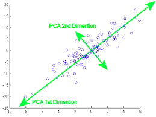
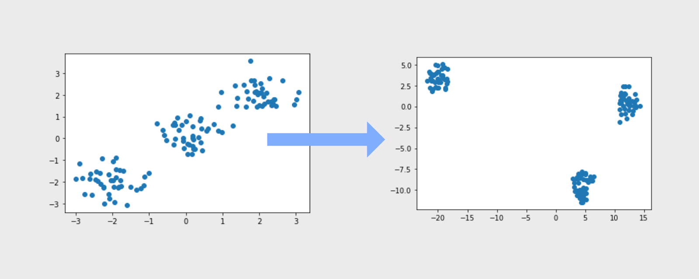

---
sources:
  - page: "Dimensionality Reduction"
    course_id: 141735
    item_id: 7718209
---

# Dimensionality Reduction

Real-world datasets are often **high-dimensional** — many columns / **features** per
observation. High dimensionality hurts because:

- it is hard to **analyse or visualise** the data and spot hidden patterns, and
- not all features are **equally important**.

**Dimensionality reduction** re-describes the data with **fewer features** while losing as
little information as possible, making it easier to visualise and to model. Two key
techniques are **PCA** and **t-SNE**.

## PCA (Principal Component Analysis)

The idea of **PCA** is to reduce the dimensionality of a dataset of many correlated
variables while **retaining as much of the variation** as possible.

PCA transforms the original variables into a new set of coordinates — the **principal
components (PCs)** — that are **orthogonal** (uncorrelated) to one another. The components
are ordered so that the **first PC captures the most variance**, the second the next most,
and so on. Keeping only the first few PCs gives a low-dimensional view that preserves most
of the structure.



Crucially, the **principal components are the [[Eigenvectors and Eigenvalues|eigenvectors]]
of the [[Covariance Matrix]]** (hence they are orthogonal), and each PC's variance is its
eigenvalue.

## t-SNE

**t-SNE** (t-distributed Stochastic Neighbor Embedding) computes a **similarity** between
pairs of points in the high-dimensional space and in the low-dimensional space, then makes
the low-dimensional similarities match the high-dimensional ones. The mismatch between the
two probability distributions is measured with [[KL Divergence|Kullback–Leibler divergence]]
and minimised. Unlike PCA, t-SNE is **non-linear** and is used mainly for **visualisation**.



## Python hands-on

```python
from sklearn.decomposition import PCA
from sklearn.manifold import TSNE

pcs = PCA(n_components=2).fit_transform(X)     # linear, variance-preserving
emb = TSNE(n_components=2).fit_transform(X)    # non-linear, for visualisation
```

## Summary

- Dimensionality reduction keeps the **signal** while dropping dimensions.
- **PCA**: linear; principal components are orthogonal eigenvectors of the covariance
  matrix, ordered by variance captured.
- **t-SNE**: non-linear; matches pairwise similarities, optimised via KL divergence; great
  for plotting clusters.
