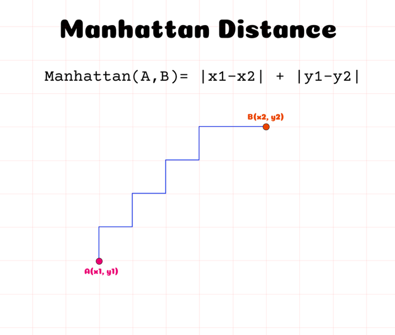

---
sources:
  - page: "Distance and Scaling Measures"
    course_id: 141735
    item_id: 7718269
---

# Distance and Scaling Measures

Clustering algorithms group data using a **distance** (or similarity / dissimilarity)
measure between every pair of observations. Points that are **close** on the chosen metric
are likely to land in the **same** cluster; points that are **far apart** are likely to be
separated. This is computed via a **distance matrix** holding the distance between every
pair of points.

## Distance measures

**Euclidean distance** — the straight-line distance: the square root of the sum of squared
differences. For points $P=(x_1,y_1)$ and $Q=(x_2,y_2)$:

$$
d = \sqrt{(x_2 - x_1)^2 + (y_2 - y_1)^2}
$$

**Manhattan distance** (city-block distance) — the distance along an orthogonal,
zig-zag grid (sum of absolute differences):

$$
d = |x_2 - x_1| + |y_2 - y_1|
$$



## Why scaling matters

Features often come in **different units** (kilometres, hours, kilograms) and therefore
**different scales**. A distance-based algorithm would otherwise treat "1 km" as equal in
importance to "1 kg", and a feature whose raw numbers are large would dominate the distance
purely because of its magnitude — drowning out features with smaller numbers.

Scaling puts every variable on a comparable footing so each contributes fairly to the
algorithm's decisions.

### Normalization

Rescales values into the range $[0, 1]$:

$$
y = \frac{x - \min}{\max - \min}
$$

where $\min$ and $\max$ are the minimum and maximum of the feature.

### Standardization

Rescales so the mean is $0$ and the [[Standard Deviation|standard deviation]] is $1$:

$$
y = \frac{x - \mu}{\sigma}
$$

(This is the same transformation as the [[Z-Score]].)

## Python hands-on

```python
from sklearn.preprocessing import MinMaxScaler, StandardScaler

X_norm = MinMaxScaler().fit_transform(X)      # -> [0, 1]
X_std  = StandardScaler().fit_transform(X)    # mean 0, std 1
```

## Summary

- Clustering relies on a **distance metric**: **Euclidean** (straight line) or
  **Manhattan** (grid) are the common choices.
- Because features have different units/scales, **scaling is essential** for distance-based
  algorithms.
- **Normalization** → $[0,1]$; **Standardization** → mean $0$, std $1$.
