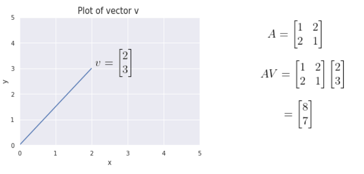
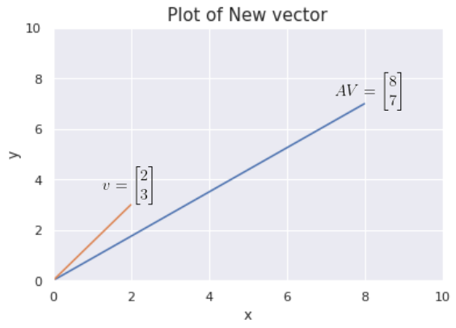
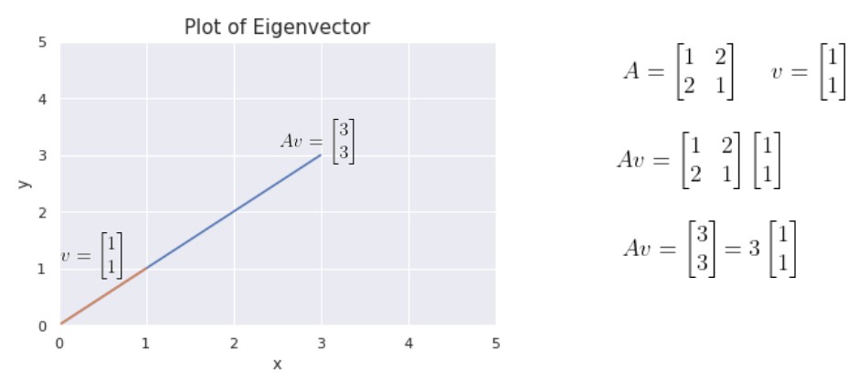

---
sources:
  - page: "Eigenvectors and Eigenvalues"
    course_id: 141735
    item_id: 7718207
---

# Eigenvectors and Eigenvalues

Multiplying a matrix $A$ by a vector $v$ produces a new, transformed vector $Av$. In
general this **linear transformation** changes both the **magnitude** and the
**direction** of $v$ (it can scale, flip, rotate, or shear).





## The special vectors that keep their direction

For some special vectors, multiplying by $A$ changes only the **magnitude** — the
**direction is unchanged**. These are the **eigenvectors** of $A$. The scalar by which an
eigenvector is stretched is its **eigenvalue**, written $\lambda$.



$$
A v = \lambda v
$$

- $A$ — the transformation matrix
- $v$ — an eigenvector (a **non-zero** vector)
- $\lambda$ — the corresponding eigenvalue (a scalar)

## Solving for eigenvalues

Move everything to one side and factor out $v$ (using the identity matrix $I$):

$$
A v - \lambda v = 0 \quad\Longrightarrow\quad (A - \lambda I)\,v = 0
$$

Because $v \neq 0$, the matrix $(A - \lambda I)$ **cannot be invertible** — if it were, we
could multiply by its inverse and force $v = 0$, a contradiction. A non-invertible matrix
has a **zero determinant**, so the eigenvalues are the solutions of the
**characteristic equation**:

$$
\det(A - \lambda I) = 0
$$

Each eigenvalue is then back-substituted into $(A - \lambda I)v = 0$ to get its
eigenvector. In practice NumPy does this for us.

## Why eigenvectors matter

Their directional invariance is the engine behind
[[Dimensionality Reduction (PCA)|Principal Component Analysis]]: the principal components
are exactly the **eigenvectors of the [[Covariance Matrix]]**, and the variance captured
along each component is the corresponding **eigenvalue**. Larger eigenvalue ⇒ more
variance retained along that direction.

## Python hands-on

```python
import numpy as np

A = np.array([[2, 0], [0, 3]])
eigvals, eigvecs = np.linalg.eig(A)   # values in eigvals, vectors in columns of eigvecs
```

## Summary

- An **eigenvector** keeps its **direction** under multiplication by $A$; only its length
  changes by the **eigenvalue** $\lambda$.
- Core equation: $Av = \lambda v \Rightarrow (A-\lambda I)v = 0$.
- Eigenvalues solve $\det(A-\lambda I)=0$ (the matrix must be singular).
- PCA's principal components are the eigenvectors of the covariance matrix.
