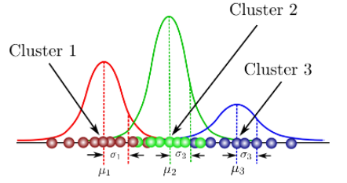
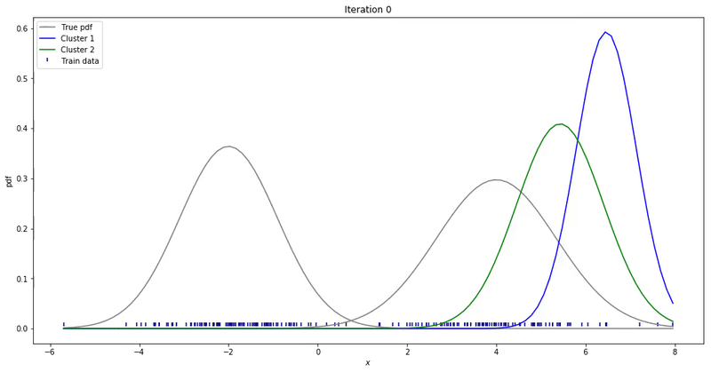
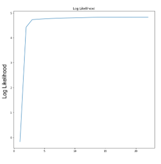

---
sources:
  - page: "Gaussian Mixture Models"
    course_id: 141735
    item_id: 7718271
---

# Gaussian Mixture Models

**Gaussian Mixture Models (GMMs)** are an [[Unsupervised Learning|unsupervised]] clustering
technique. Where [[K-means Clustering|K-means]] uses only the **mean** of each cluster, a
GMM uses both the **mean** and the **variance**, so it can model clusters of different
shapes and sizes.

A GMM assumes the data is a **mixture of several Gaussians**, and it is a **probabilistic**
model: rather than a hard assignment, each point gets a **probability** of belonging to
each cluster.



The parameters of each Gaussian — mean $\mu_k$ and variance/covariance $\Sigma_k$ — are
learned with the **Expectation–Maximization (EM)** algorithm.

## The EM algorithm

EM alternates two steps until the parameters converge.

### E-step (Expectation)

Start by placing $K$ Gaussians with some initial mean $\mu_k$ and covariance $\Sigma_k$,
plus a **mixing weight** $\pi_k$ (each cluster's relative size). Then give every point a
**soft assignment** — the **responsibility** $r_{ik}$, the probability that point $x_i$ was
generated by cluster $k$:

$$
r_{ik} = \frac{\pi_k\, N\!\left(x_i \mid \mu_k, \Sigma_k\right)}
{\sum_{j=1}^{K} \pi_j\, N\!\left(x_i \mid \mu_j, \Sigma_j\right)}
$$

So each point carries a probability vector $\left[r_{i1}, r_{i2}, \dots, r_{iK}\right]$
across the clusters.

### M-step (Maximization)

Use the responsibilities to **re-estimate** the parameters. First the **soft count** of
each cluster (sum of responsibilities over all $N$ points):

$$
N_k^{\text{soft}} = \sum_{i=1}^{N} r_{ik}
$$

Then update the **mixing weight**, **mean**, and **covariance** of each cluster:

$$
\pi_k = \frac{N_k^{\text{soft}}}{N}
$$

$$
\mu_k = \frac{1}{N_k^{\text{soft}}} \sum_{i=1}^{N} r_{ik}\, x_i
$$

$$
\Sigma_k = \frac{1}{N_k^{\text{soft}}} \sum_{i=1}^{N} r_{ik}\,
\left(x_i - \mu_k\right)\left(x_i - \mu_k\right)^{T}
$$

The E-step and M-step repeat until the parameters stop changing.



## Convergence

Convergence is judged with the **log-likelihood**: when it stops improving by more than a
small tolerance between iterations, EM has converged.

$$
\log \mathcal{L} = \sum_{i=1}^{N} \log
\left( \sum_{k=1}^{K} \pi_k\, N\!\left(x_i \mid \mu_k, \Sigma_k\right) \right)
$$



## K-means vs GMM

| | K-means | GMM |
|--|---------|-----|
| Uses | mean only | mean **and** covariance |
| Assignment | **hard** (one cluster) | **soft** (probabilities) |
| Cluster shape | spherical / equal-size | elliptical, varying size |
| Fitted by | iterative mean update | **EM** algorithm |

## Python hands-on

```python
from sklearn.mixture import GaussianMixture

gmm = GaussianMixture(n_components=2, covariance_type='full').fit(X_scaled)
labels = gmm.predict(X_scaled)            # hard labels
probs  = gmm.predict_proba(X_scaled)      # soft responsibilities r_ik
```

## Summary

- A GMM models data as a **mixture of Gaussians** and assigns points **probabilistically**.
- Parameters $\pi_k, \mu_k, \Sigma_k$ are learned by **EM**: the **E-step** computes
  responsibilities $r_{ik}$, the **M-step** re-estimates the parameters.
- Convergence is tracked via the **log-likelihood**.
- Compared with K-means, GMM captures **elliptical, unequal** clusters and gives **soft**
  memberships.
