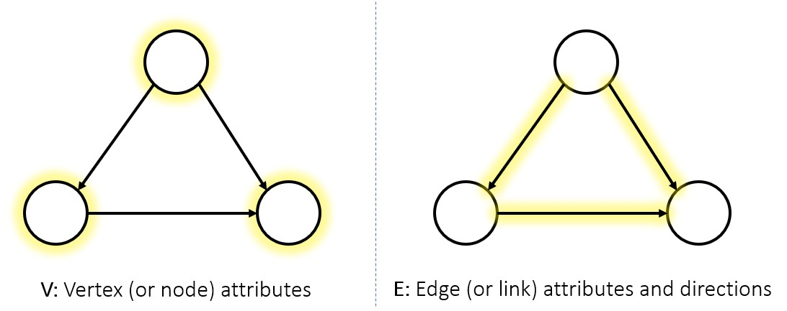
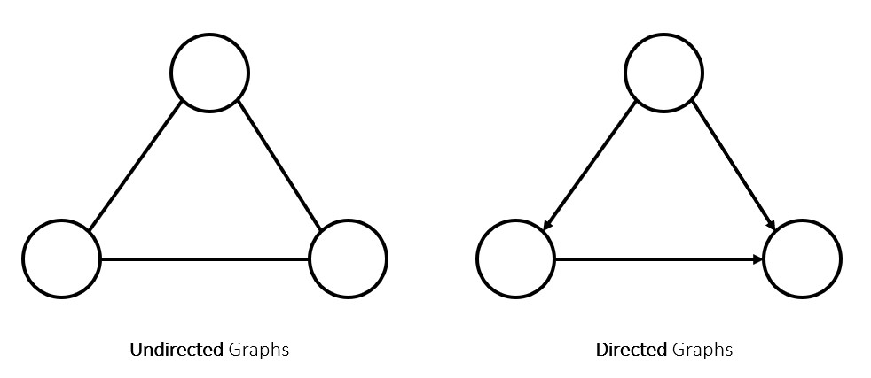

---
sources:
  - page: "Graph Theory"
    course_id: 141735
    item_id: 7718233
---

# Graph Theory

**Graph theory** studies graphical structures that model **relations** between objects.
Structurally, a graph is a collection of **nodes** (vertices) connected by **edges** (links).

Graphs power many machine-learning tasks — clustering, classification, and regression on
relational data (social networks, recommendation systems, molecules, etc.).

## Notation

A graph is written as

$$
G = (V, E)
$$

where $V$ is the set (or number) of **vertices** and $E$ is the set (or number) of
**edges**.

## Directed vs undirected

- In an **undirected graph**, an edge is simply a connection between two nodes with **no
  source or target** — the relationship goes both ways.
- In a **directed graph**, every edge has a **direction**: a clear path *from* one node
  *to* another.

Edges can also carry a **weight** (a numeric strength or cost), giving a *weighted* graph —
see [[Matrix Representation of Graphs]] for how all of these are encoded as matrices.

## Summary

- A **graph** $G=(V,E)$ is **nodes** joined by **edges**.
- **Undirected** edges are bidirectional; **directed** edges have a from→to direction.
- Edges may be **weighted**; graphs underpin clustering, classification, and network
  analysis.
