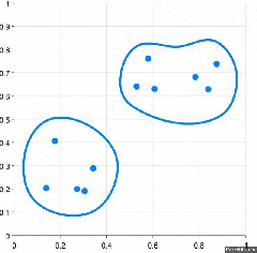
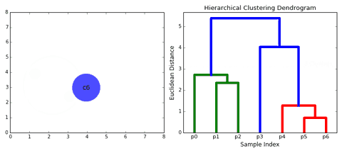

---
sources:
  - page: "Hierarchical Clustering"
    course_id: 141735
    item_id: 7718272
---

# Hierarchical Clustering

**Hierarchical clustering** builds a **hierarchy** of clusters. There are two directions:

- **Agglomerative** — bottom-up.
- **Divisive** — top-down.

## Agglomerative clustering (bottom-up)

1. Start with $N$ data points as $N$ separate clusters (one point each).
2. Find the **two closest** clusters and **merge** them → $N-1$ clusters.
3. Repeat, each time merging the two nearest clusters, until a **single** cluster contains
   every point.



### Linkage — how to measure distance between clusters

The distance between two clusters depends on the **linkage** method:

- **Single-linkage** — the **shortest** distance between any two points (one in each
  cluster). Can chain outliers together (merged last).
- **Complete-linkage** — the **longest** distance between any two points in the two
  clusters.
- **Average-linkage** — the **average** distance over all cross-cluster point pairs.
  Average- and complete-linkage are the two most popular choices.
- **Centroid-linkage** — the distance between the two clusters' **centroids**.

## Divisive clustering (top-down)

The reverse process:

1. Start with **all** points in **one** cluster.
2. **Split** it into two clusters.
3. Keep splitting until every point is its own cluster.

## The dendrogram

A **dendrogram** is a tree diagram showing the hierarchical relationships and the order in
which clusters were merged (or split). Cutting the dendrogram at a chosen height yields a
particular number of clusters — so, unlike [[K-means Clustering|K-means]], you don't have to
fix $K$ up front.



## Python hands-on

```python
from scipy.cluster.hierarchy import linkage, dendrogram
from sklearn.cluster import AgglomerativeClustering

Z = linkage(X_scaled, method='ward')      # build the hierarchy
dendrogram(Z)                              # visualise it

labels = AgglomerativeClustering(n_clusters=3, linkage='average').fit_predict(X_scaled)
```

## Summary

- **Agglomerative** = bottom-up merging; **divisive** = top-down splitting.
- The **linkage** (single / complete / average / centroid) defines inter-cluster distance.
- A **dendrogram** visualises the hierarchy; cut it at any height to choose the number of
  clusters.
