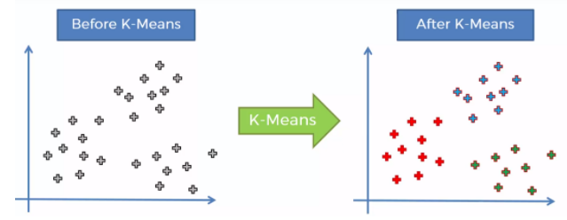
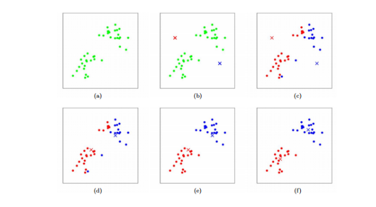
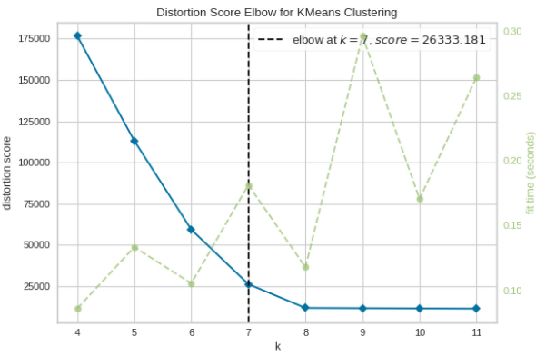
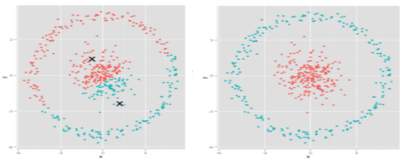

---
sources:
  - page: "K-means Clustering"
    course_id: 141735
    item_id: 7718270
---

# K-means Clustering

**K-means** is an [[Unsupervised Learning|unsupervised]] algorithm that groups similar
points into **$K$ clusters**. Each cluster is summarised by its **centroid** — the
geometric centre (mean) of the points assigned to it.



## How the algorithm works

1. **Choose $K$** — the number of clusters.
2. **Initialise the centroids** (often randomly).
3. **Assign** each point to its **nearest centroid** (by [[Distance and Scaling Measures|Euclidean distance]]).
4. **Update** each centroid to the **mean** of the points assigned to it (hence
   "K-*means*").
5. **Repeat** steps 3–4 until the centroids stop moving (**convergence**).

The assignment step uses Euclidean distance between point $(x_1,y_1)$ and centroid
$(x_2,y_2)$:

$$
d = \sqrt{(x_2 - x_1)^2 + (y_2 - y_1)^2}
$$

so that the **within-cluster sum of squares** is minimised.



### Worked example

For points $\{2,3,4,5,10,11,13,15\}$ on a line with $K=2$ and initial centroids
$c_1=3$, $c_2=12$ (here distance is just $|x_2 - x_1|$):

- Each point joins its nearer centroid → $c_1$ gets $\{2,3,4,5\}$, $c_2$ gets $\{10,11,13,15\}$.
- Update the centroids to the cluster means:
  $c_1 = \tfrac{2+3+4+5}{4} = 3.5$, $c_2 = \tfrac{10+11+13+15}{4} = 12.25$.
- Repeat until the centroids no longer change.

## Choosing K — the Elbow method

$K$ is **not learned** — we must pick it. The **Elbow method** runs K-means for a range of
$K$ values and, for each, computes the **WCSS** (Within-Cluster Sum of Squares): the total
squared distance from points to their centroids. Plotting WCSS against $K$ produces an
elbow shape — WCSS always falls as $K$ grows, but after the **elbow** the gains become
marginal. That elbow is the optimal $K$ (here, $K=7$).



## Practical notes

- **Always scale** the data first ([[Distance and Scaling Measures|normalize/standardize]]) —
  features on larger scales otherwise dominate the squared-error.
- Random initialisation means different runs can give different clusters, and the algorithm
  can get stuck in a **local optimum**. Run it several times and keep the solution with the
  lowest within-cluster sum of squares.

## Assumptions and limitations

K-means assumes **linear (convex) cluster boundaries** — that points are closer to their
own centre than to others. It therefore struggles with complex geometries, and implicitly
assumes clusters are of **similar size, similar spread in every direction, and similar
membership counts**.



## Applications

- **Document clustering** — group similar documents.
- **Customer segmentation** — group similar customers.
- **Image segmentation** — group similar pixels.

## Python hands-on

```python
from sklearn.cluster import KMeans

km = KMeans(n_clusters=2, n_init=10, random_state=0).fit(X_scaled)
labels = km.labels_
centroids = km.cluster_centers_
inertia = km.inertia_          # WCSS, used for the elbow plot
```

## Summary

- K-means alternates **assign-to-nearest-centroid** and **update-centroid-to-mean** until
  convergence, minimising within-cluster squared distance.
- Pick $K$ with the **Elbow method** (WCSS vs $K$).
- **Scale** features first; re-run to avoid local optima.
- Assumes roughly **convex, equal-sized** clusters — fails on non-convex shapes (see
  [[DBSCAN]] and [[Gaussian Mixture Models]] for alternatives).
