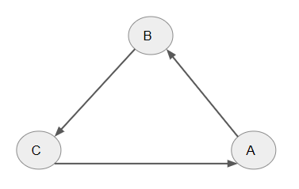
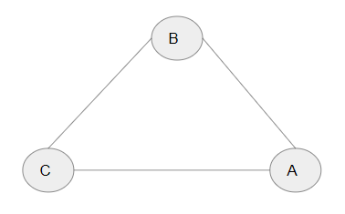
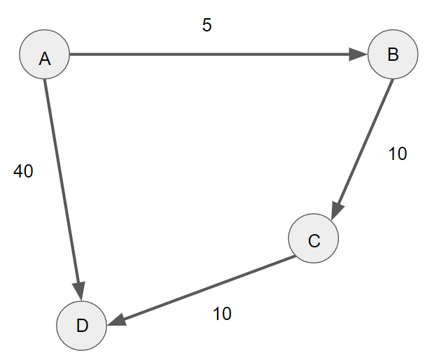
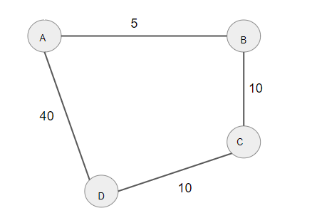

---
sources:
  - page: "Matrix Representation of Graphs"
    course_id: 141735
    item_id: 7718234
---

# Matrix Representation of Graphs

A graph can be written as a matrix. The **adjacency matrix** records the connections
between nodes as the entries of a matrix — this equivalence between graphs and matrices is
a cornerstone of modern [[Graph Theory]] and lets graph algorithms use linear algebra.

## Adjacency matrix — directed graph

Consider a directed graph with edges $A \to B$, $B \to C$, $C \to A$:

Entry $(i, j) = 1$ when there is an edge **from** node $i$ **to** node $j$, else $0$. With
rows/columns ordered $A, B, C$:

$$
\begin{array}{c|ccc}
 & A & B & C \\ \hline
A & 0 & 1 & 0 \\
B & 0 & 0 & 1 \\
C & 1 & 0 & 0
\end{array}
$$

For instance $A \to B$ puts a $1$ in row $A$, column $B$; all unconnected pairs are $0$.

## Adjacency matrix — undirected graph

An undirected edge has no direction, so if $A$ and $B$ are linked we mark **both**
$(A,B)$ and $(B,A)$ — the matrix is **symmetric**. Here $A$, $B$, $C$ are all mutually
connected:

$$
\begin{array}{c|ccc}
 & A & B & C \\ \hline
A & 0 & 1 & 1 \\
B & 1 & 0 & 1 \\
C & 1 & 1 & 0
\end{array}
$$

## Weighted adjacency matrix

A **weighted** graph attaches a numeric weight to each edge. The weighted adjacency matrix
is built like the ordinary one, but the entries store the **weights** instead of $1$s.

### Weighted directed graph

Edges $A\!\to\!B = 5$, $A\!\to\!D = 40$, $B\!\to\!C = 10$, $C\!\to\!D = 10$:

$$
\begin{array}{c|cccc}
 & A & B & C & D \\ \hline
A & 0 & 5 & 0 & 40 \\
B & 0 & 0 & 10 & 0 \\
C & 0 & 0 & 0 & 10 \\
D & 0 & 0 & 0 & 0
\end{array}
$$

### Weighted undirected graph

The same edges, now undirected, so the weight matrix is **symmetric**:

$$
\begin{array}{c|cccc}
 & A & B & C & D \\ \hline
A & 0 & 5 & 0 & 40 \\
B & 5 & 0 & 10 & 0 \\
C & 0 & 10 & 0 & 10 \\
D & 40 & 0 & 10 & 0
\end{array}
$$

## Summary

- The **adjacency matrix** encodes a graph: entry $(i,j)$ marks an edge from $i$ to $j$.
- **Directed** graphs give a (generally) non-symmetric matrix; **undirected** graphs give a
  **symmetric** one.
- A **weighted** adjacency matrix stores edge **weights** in place of $1$s.
