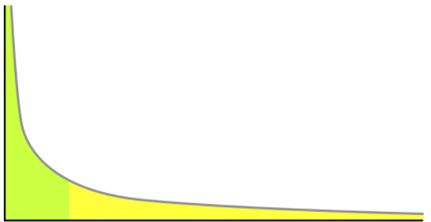
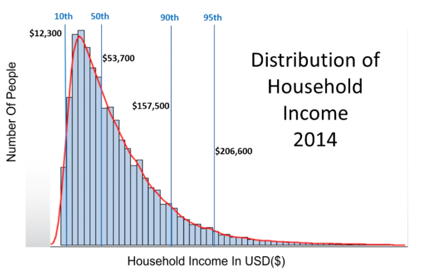
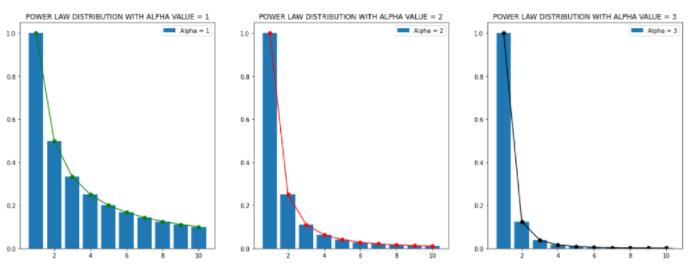

---
sources:
  - page: "Power-Law Distribution"
    course_id: 141735
    item_id: 7718232
---

# Power-Law Distribution

A **power-law distribution** describes situations where a **small number** of observations
have a **very high** value of some characteristic, while a **large number** have a **small**
value. Many unequally-distributed real-world phenomena follow this shape.

## Examples

- **Instagram followers:** most users (regular profiles) have few followers, while a tiny
  fraction (celebrities, verified handles) have enormous follower counts.
- **US household income (2014):** the 90th percentile was \$157,500, so 90% of households
  earned less; only a very few earn extremely high incomes — the long thin tail.

## The mathematics

A power law relates a quantity $P_k$ to a variable $k$ via a constant $c$ and an exponent
$\alpha$:

$$
P_k = c\,k^{-\alpha}
$$

Taking logs of both sides turns it into a **straight line** on log–log axes — the
signature used to identify power laws:

$$
\log P_k = -\alpha\,(\log k) + c
$$

Here $\alpha$ (alpha) is the law's **exponent**. As the magnitude of $\alpha$ increases,
the curve becomes **steeper** (a faster-decaying tail).

## Why it matters

Power-law (scale-free) behaviour is common in **networks** — e.g. the degree distribution
of nodes in social or web graphs — connecting this idea to [[Graph Theory]] and
[[Matrix Representation of Graphs]].

## Summary

- A power law: **few** observations with **very high** values, **many** with **low** values
  (a long tail).
- $P_k = c\,k^{-\alpha}$, which is **linear on log–log axes**: $\log P_k = -\alpha\log k + c$.
- Larger $\alpha$ ⇒ **steeper** decay. Common in network degree distributions and income.
