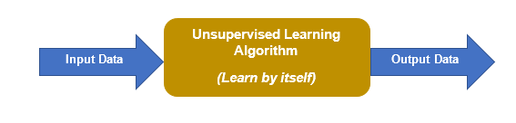
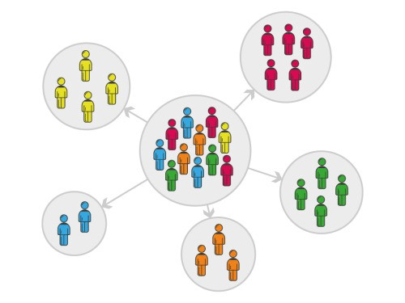

---
sources:
  - page: "Unsupervised Learning"
    course_id: 141735
    item_id: 7718268
---

# Unsupervised Learning

Machine-learning techniques fall into three broad categories:

- **[[Supervised Learning]]** — the algorithm learns from **labeled** data (each example
  has a known correct output).
- **Unsupervised learning** — there are **no labels**; the algorithm learns from
  **unlabeled** data by finding patterns and grouping examples itself.
- **Reinforcement learning** — the algorithm learns by **acting** to maximise a reward,
  using feedback from its environment.

## What unsupervised learning does

Given a large volume of **unlabeled** data, an unsupervised algorithm is expected to
**identify hidden patterns** on its own. Because there is no label and no "correct"
answer, the machine simply determines **whether structure exists** in the data.

Typical use cases:

- **Clustering** — group similar observations together.
- **Association** — find rules / items that co-occur.
- **[[Dimensionality Reduction (PCA)|Dimensionality reduction]]** — compress features
  while preserving structure.

## Clustering

The core idea of **clustering** is to split data into groups so that each group is
**internally similar** and **as dissimilar as possible** from the other groups.

**Example — customer segmentation.** A company wants to target the right audience for a new
product, so it segments customers by demographics (age, gender, occupation), by income and
spending habits, or by geographic location.

There were **no labels** describing these people — only features (age, gender, income, …).
The algorithm found groups of similar individuals on its own. We don't know in advance what
each group "means"; we only know its members are alike for *some* reason and unlike members
of other groups.

## Where to go next

- [[Distance and Scaling Measures]] — how similarity between points is computed.
- [[K-means Clustering]], [[Gaussian Mixture Models]], [[Hierarchical Clustering]],
  [[DBSCAN]] — specific clustering algorithms.

## Summary

- Unsupervised learning finds structure in **unlabeled** data; there is **no target**.
- Main tasks: **clustering**, **association**, **dimensionality reduction**.
- **Clustering** groups similar points together and separates dissimilar ones — without
  ever being told the groups.
